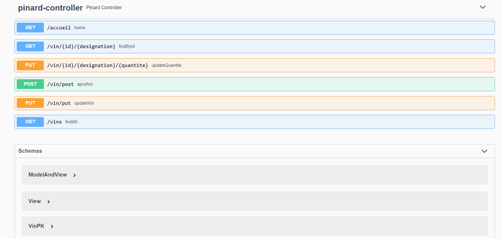

# Swagger et data.sql avec Spring Boot

Ce projet reprend le TP Pinard04 en y ajoutant l'interface *Swagger version 3.0* et
l'insertion automatique de données via un fichier SQL dans le répertoire Resources de Spring Boot.

## Swagger 3.0



[Pour la configuration avec Swagger 3.0 c'est ici](https://pbouget.github.io/cours/framework-back/swagger/README.html)

## Insertion des données

Pour la partie insertion automatique des données, voici le code déjà ajouté dans la démo :

- Dans application.properties :

```java
# JPA/Hibernate
spring.jpa.show-sql=true
spring.jpa.hibernate.ddl-auto=create
spring.jpa.properties.hibernate.dialect = org.hibernate.dialect.MySQL5InnoDBDialect

# Permet exécution du data.sql pour insertion des données en base (si elle existe !)
spring.jpa.properties.hibernate.globally_quoted_identifiers=true
spring.jpa.defer-datasource-initialization=true
spring.sql.init.mode=always
spring.datasource.initialization-mode=always
```

- Contenu du fichier *data.sql* :

```sql
INSERT INTO vin (code_produit, designation, couleur, prix, quantite, region, remise) VALUES
(111111, 'Clos du Baron 2015', 'BLANC', 45.2, 50, 'Bordeaux (Saint-Julien)', 0);
INSERT INTO vin (code_produit, designation, couleur, prix, quantite, region, remise) VALUES
(777777, 'Les Hauts du Tertre 2005', 'ROUGE', 11.5, 2, 'Bordeaux (Margaux)', 0);
INSERT INTO vin (code_produit, designation, couleur, prix, quantite, region, remise) VALUES
(888888, 'Château Marquis de Terme 1899', 'BLANC', 19, 3, 'Bordeaux (Margaux)', 0);
INSERT INTO vin (code_produit, designation, couleur, prix, quantite, region, remise) VALUES
(999999, 'Clos du Marquis 2007', 'ROUGE', 22.9, 15, 'Bordeaux (Saint-Julien)', 0);
```

## Projet Eclipse/Gradle

- Importez tout simplement le projet Pinard04Swagger *Gradle* depuis votre IDE.
- Pensez à modifier le nom de la base de données(qui doit exister !), le username et le password
- Faites un refresh de Gradle pour les dépendances et lancez votre application

[Retour vers les exercices](https://pbouget.github.io/cours/framework-back/1-jpa-orm/mapping-orm.html)

[Retour vers le cours complet](https://pbouget.github.io/cours/)